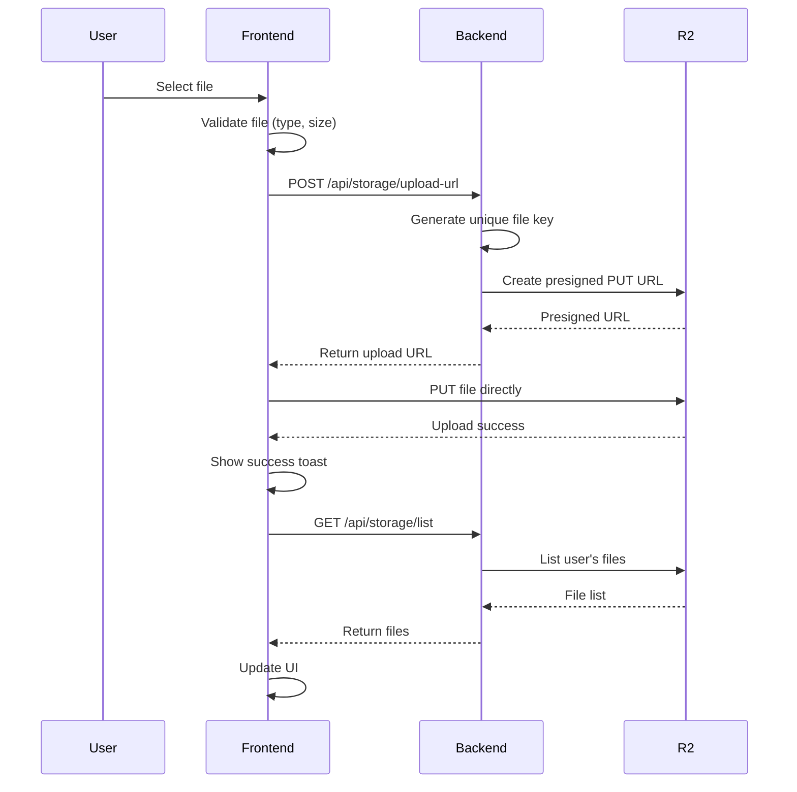

# File Storage System Documentation

## Overview

Our file storage system uses **Cloudflare R2** (S3-compatible object storage) to store user-uploaded images. The system provides secure, isolated storage for each user with presigned URLs for direct uploads and downloads.

## Architecture

### Storage Provider
- **Service**: Cloudflare R2
- **Protocol**: S3-compatible API
- **SDK**: AWS SDK for JavaScript v3 (`@aws-sdk/client-s3`)
- **Authentication**: Access Key ID and Secret Access Key stored in environment variables

### File Organization
```
bucket: os-saas-starter-1/
└── uploads/
    └── {userId}/
        ├── {timestamp}-{sanitized-filename}.jpg
        ├── {timestamp}-{sanitized-filename}.png
        └── {timestamp}-{sanitized-filename}.webp
```

## Backend Implementation

### Configuration (`/apps/server/src/lib/storage.ts`)
```typescript
import { S3Client } from "@aws-sdk/client-s3";

export const r2 = new S3Client({
  region: "auto",
  endpoint: `https://{accountId}.r2.cloudflarestorage.com`,
  credentials: {
    accessKeyId: process.env.R2_ACCESS_KEY_ID!,
    secretAccessKey: process.env.R2_SECRET_ACCESS_KEY!,
  },
});
```

### API Endpoints (`/apps/server/src/routes/storage.ts`)

#### 1. List Files - `GET /api/storage/list`
- **Purpose**: Retrieve all files uploaded by the authenticated user
- **Authentication**: Required (authMiddleware)
- **Response**: Array of file metadata
- **Implementation**:
  ```typescript
  ListObjectsV2Command({
    Bucket: 'os-saas-starter-1',
    Prefix: `uploads/${user.id}/`,
    MaxKeys: 100
  })
  ```

#### 2. Generate Upload URL - `POST /api/storage/upload-url`
- **Purpose**: Generate presigned URL for direct file upload to R2
- **Authentication**: Required
- **Request Body**:
  ```json
  {
    "fileName": "example.jpg",
    "fileType": "image/jpeg",
    "fileSize": 1048576
  }
  ```
- **Validation**:
  - File type: Only images (jpeg, jpg, png, gif, webp)
  - File size: Maximum 10MB
- **Response**: Presigned upload URL (expires in 10 minutes)

#### 3. Generate Download URL - `POST /api/storage/download-url`
- **Purpose**: Generate presigned URL for viewing/downloading files
- **Authentication**: Required
- **Request Body**:
  ```json
  {
    "fileKey": "uploads/userId/timestamp-filename.jpg"
  }
  ```
- **Response**: Presigned download URL (expires in 1 hour)

## Frontend Implementation

### React Hooks (`/apps/web-app/src/api/storage.ts`)

#### 1. `useListFiles()`
- **Purpose**: Fetch all user's uploaded files
- **Usage**: Auto-fetches on component mount
- **Returns**: File list with metadata

#### 2. `useUploadFile()`
- **Purpose**: Handle file upload process
- **Process**:
  1. Get presigned upload URL from backend
  2. Upload file directly to R2 using presigned URL
  3. Invalidate file list cache to show new file
- **Features**:
  - Success/error toast notifications
  - Automatic list refresh after upload

#### 3. `useGetDownloadUrl()`
- **Purpose**: Get presigned URL for viewing files
- **Usage**: Called when user clicks "View" button
- **Returns**: Temporary URL for file access

### UI Component (`/apps/web-app/src/routes/(app)/images.tsx`)
- **Route**: `/images`
- **Features**:
  - File upload interface with drag-and-drop
  - Grid view of uploaded images
  - Loading and error states
  - File metadata display (name, size, date)
  - Click-to-view functionality

## Security Features

### 1. User Isolation
- Files stored in user-specific folders (`uploads/{userId}/`)
- No cross-user file access possible

### 2. Presigned URLs
- **Upload URLs**: Expire in 10 minutes
- **Download URLs**: Expire in 1 hour
- URLs are single-use and time-limited

### 3. File Validation
- Type restriction: Images only
- Size limit: 10MB per file
- Filename sanitization: Special characters replaced with underscores

### 4. Authentication
- All endpoints require authenticated session
- User ID extracted from auth session, not request body

## Environment Variables

Required in `/apps/server/.env`:
```env
R2_ACCESS_KEY_ID=your-r2-access-key-id
R2_SECRET_ACCESS_KEY=your-r2-secret-access-key
```

## File Upload Flow



## Limitations

1. **File Types**: Currently limited to images only
2. **File Size**: Maximum 10MB per file
3. **List Limit**: Returns maximum 100 files per user
4. **No Folders**: Flat file structure within user directory
5. **No Rename**: Files cannot be renamed after upload
6. **No Delete**: No file deletion endpoint implemented

## Future Enhancements

1. **Add file deletion** capability
2. **Support more file types** (PDFs, documents)
3. **Implement file metadata** editing
4. **Add bulk upload** functionality
5. **Create thumbnail generation** for images
6. **Add file sharing** capabilities
7. **Implement pagination** for file listing
8. **Add file search** functionality

## Usage Example

```typescript
// In a React component
import { useUploadFile, useListFiles, useGetDownloadUrl } from '@/api';

function ImageGallery() {
  const { data: files, isLoading } = useListFiles();
  const uploadFile = useUploadFile();
  const getDownloadUrl = useGetDownloadUrl();

  const handleUpload = async (file: File) => {
    await uploadFile.mutateAsync(file);
  };

  const handleView = async (fileKey: string) => {
    const { downloadUrl } = await getDownloadUrl.mutateAsync(fileKey);
    window.open(downloadUrl, '_blank');
  };

  return (
    // UI components
  );
}
```

## Troubleshooting

### Common Issues

1. **"Failed to generate upload URL"**
   - Check R2 credentials in environment variables
   - Verify bucket name and permissions

2. **"Invalid file type"**
   - Ensure file is an image (JPEG, PNG, GIF, WebP)
   - Check file extension matches content type

3. **Files not showing after upload**
   - Check browser console for errors
   - Verify file was uploaded to correct user folder
   - Ensure list endpoint is working properly

4. **CORS errors during upload**
   - Configure R2 bucket CORS policy
   - Ensure presigned URL includes proper headers