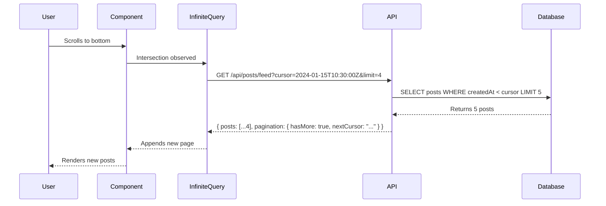

# Infinite Scroll Architecture Documentation

## Overview
This document explains how the infinite scroll pagination system works in the linkBD posts feed, covering the complete flow from database queries to frontend rendering.

## System Architecture

### 1. Database Layer (PostgreSQL + Drizzle ORM)

#### Schema Indexes
The posts table has optimized indexes for pagination performance:

```typescript
// apps/server/src/db/schema.ts
export const posts = pgTable('posts', {
  // ... column definitions
}, (table) => ({
  // Pagination performance indexes
  visibilityCreatedAtIdx: index('idx_posts_visibility_created_at')
    .on(table.visibility, table.createdAt.desc()),
  likesCountCreatedAtIdx: index('idx_posts_likes_count_created_at')
    .on(table.likesCount.desc(), table.createdAt.desc()),
}))
```

These indexes ensure fast queries even with millions of posts.

### 2. Backend API Layer (Hono.js)

#### Cursor-Based Pagination Model
```typescript
// apps/server/src/models/posts.ts
export async function getPublicPostsPaginated(options: PaginationOptions = {}) {
  const { 
    limit = 20, 
    cursor,     // ISO timestamp for pagination
    direction = 'after',
    sortBy = 'newest'
  } = options;

  // Builds WHERE conditions with cursor filtering
  // Returns limit + 1 posts to determine hasMore
  // Returns pagination metadata with nextCursor
}
```

**Key Features:**
- Uses timestamp-based cursors (ISO strings) instead of offsets
- Fetches `limit + 1` posts to efficiently determine if more exist
- Supports multiple sort options (newest, oldest, popular)
- Returns structured response with pagination metadata

#### API Endpoint
```typescript
// apps/server/src/routes/posts.ts
.get('/feed', authMiddleware, zValidator('query', paginationSchema), async (c) => {
  const result = await postModel.getPublicPosts({
    cursor,
    limit,
    direction,
    sortBy
  });
  
  return c.json({
    posts: postsWithDetails,
    pagination: {
      hasMore: boolean,
      nextCursor: string | null,
      limit: number,
      count: number
    }
  });
})
```

### 3. Frontend Layer (React + TanStack Query)

#### Infinite Query Hook
```typescript
// apps/web-app/src/api/posts.ts
export const useInfinitePostsFeed = (limit = 10) => {
  return useInfiniteQuery({
    queryKey: ['posts', 'feed', 'infinite', limit],
    queryFn: async ({ pageParam }) => {
      const response = await rpcClient.api.posts.feed.$get({
        query: {
          cursor: pageParam,  // Previous page's nextCursor
          limit: limit.toString(),
          sortBy: 'newest',
        },
      });
      return response.json();
    },
    initialPageParam: undefined,
    getNextPageParam: (lastPage) => {
      return lastPage.pagination.hasMore 
        ? lastPage.pagination.nextCursor 
        : undefined;
    },
  });
};
```

#### Component Implementation
```typescript
// apps/web-app/src/components/posts/posts-feed-view.tsx
export function PostsFeedView() {
  const loadMoreRef = useRef<HTMLDivElement>(null)
  
  const { 
    data, 
    fetchNextPage, 
    hasNextPage, 
    isFetchingNextPage 
  } = useInfinitePostsFeed(4)  // 4 posts per page
  
  // Flatten all pages into single array
  const posts = data?.pages.flatMap(page => page.posts) || []
  
  // Intersection Observer for auto-loading
  useEffect(() => {
    const observer = new IntersectionObserver(
      (entries) => {
        if (entries[0].isIntersecting && hasNextPage) {
          fetchNextPage()
        }
      },
      { threshold: 0.1 }
    )
    
    if (loadMoreRef.current) {
      observer.observe(loadMoreRef.current)
    }
    
    return () => observer.disconnect()
  }, [hasNextPage, fetchNextPage])
}
```

## Data Flow Sequence



## Key Implementation Details

### 1. Cursor-Based vs Offset Pagination

**Why Cursor-Based?**
- **Performance**: O(1) complexity regardless of position
- **Consistency**: No duplicates when new posts are added
- **Scalability**: Works efficiently with millions of posts

**How It Works:**
- Each page returns a `nextCursor` (timestamp of last post)
- Next request uses this cursor to fetch posts created before that time
- Database uses indexed `createdAt` column for fast lookups

### 2. Intersection Observer Pattern

The component uses the Intersection Observer API to detect when the user scrolls near the bottom:

```javascript
// Trigger zone: 20vh height div at bottom of feed
<div ref={loadMoreRef} className="h-20">
  {/* Loading indicator or end message */}
</div>
```

When this element enters the viewport (10% visible), it triggers `fetchNextPage()`.

### 3. Cache Management

TanStack Query manages the cache with:
- **Page-based caching**: Each page stored separately
- **Stale time**: 5 minutes before refetch
- **Query invalidation**: On create/update/delete operations

```typescript
// Invalidation on mutations
queryClient.invalidateQueries({ 
  queryKey: ['posts', 'feed', 'infinite'] 
})
```

### 4. Performance Optimizations

#### Database Level
- Composite indexes on `(visibility, createdAt DESC)`
- Query only fetches required columns
- Limit + 1 pattern for efficient `hasMore` check

#### API Level
- No total count queries (expensive on large datasets)
- Cursor-based filtering uses indexed columns
- Configurable page sizes (default 20, currently 4 for testing)

#### Frontend Level
- Progressive loading (4-20 posts at a time)
- Flattened array prevents nested rendering
- Memoized callbacks prevent unnecessary re-renders
- Intersection Observer prevents scroll listener overhead

## Configuration

### Page Size
Currently set to 4 posts per page for testing. In production, recommend 10-20:

```typescript
// apps/web-app/src/components/posts/posts-feed-view.tsx
useInfinitePostsFeed(4)  // Change to 20 for production
```

### Sort Options
The API supports three sort modes:
- `newest`: Default, chronological order
- `oldest`: Reverse chronological
- `popular`: By likes count, then date

### Loading States

The system provides three distinct states:

1. **Initial Loading**: Full page spinner
2. **Loading More**: Inline spinner at bottom
3. **End of Feed**: "You've reached the end!" message

## Error Handling

- **Network Errors**: Displayed with retry option
- **Empty States**: "No posts yet" message
- **Failed Page Loads**: Automatic retry on scroll

## Future Enhancements

1. **Optimistic Updates**: Update cache immediately on like/delete
2. **Virtual Scrolling**: For extremely long feeds
3. **Bidirectional Scrolling**: Load previous pages when scrolling up
4. **Real-time Updates**: WebSocket integration for new posts
5. **Persistent Scroll Position**: Remember position on navigation

## Testing Considerations

1. **Load Testing**: Test with 10,000+ posts
2. **Network Conditions**: Test on slow 3G
3. **Edge Cases**: 
   - Empty feed
   - Single page of posts
   - Rapid scrolling
   - Concurrent updates

## Monitoring

Key metrics to track:
- Average page load time
- P95 query execution time
- Cache hit ratio
- Scroll depth per session
- Posts loaded per user

## Conclusion

This infinite scroll implementation provides a smooth, performant user experience that scales to millions of posts. The cursor-based approach ensures consistency, while the Intersection Observer pattern creates a seamless browsing experience similar to major social platforms.